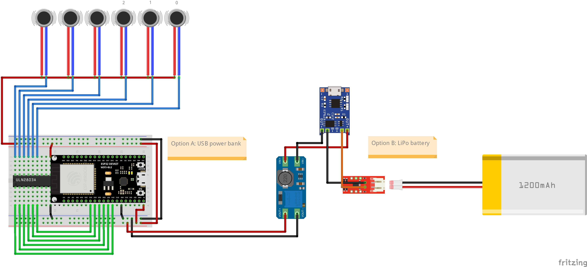

# X6 Facial Haptic Interface

> X6 Facial Haptic Interface with 3V/5V vibro motors, optionally powered by LiPo battery

## Compatible Devices

* Tactal

## Bill of materials

| Component                                      | Quantity |    Price | Link  |
| :--------------------------------------------- | -------: | -------: | :---- |
| `ESP32-DevKitC`                                |       x1 | ~US $1.3 | `n/a` |
| `ULN2803A`                                     |       x2 | ~US $0.3 | `n/a` |
| 3V/5V Vibro Motors                             |      x16 | ~US $1.1 | `n/a` |
| `TP4056` (Optional)                            |       x1 | ~US $0.3 | `n/a` |
| `MT3608` (Optional)                            |       x1 | ~US $0.4 | `n/a` |
| LiPo Battery (Optional)                        |       x1 | ~US $7.0 | `n/a` |
| `MAX17043` or `MAX17048` Fuel Gauge (Optional) |       x1 | ~US $5   | `n/a` |

## Schematic

### Required Pins

* PWA pins: `32`, `33`, `25`, `26`, `27`, `14`
* SDA: `21`
* SCL: `22`

### Wiring Diagram

> Please note motor indices
