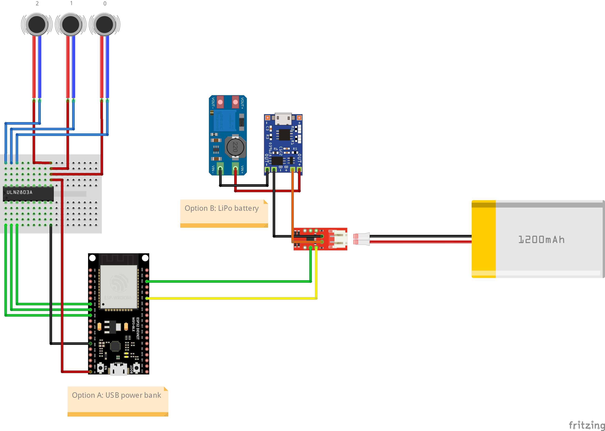

# X3 Haptic Gauntlet

> X3 Haptic Gauntlet with 3V/5V vibro motors, optionally powered by LiPo battery

> **Warning**  
> **Disclaimer:** This design is a **functional prototype**, not a complete product. There is absolutely no warranty, and you will make this design at your OWN risk. I will not be responsible for any damages associated with this design.

## Compatible Devices

* Tactosy for Hands

## Bill of materials

> **Note**  
> Following table is for a single device, and you most likely will require 2 of them

| Component                                      | Quantity |    Price | Link  |
| :--------------------------------------------- | -------: | -------: | :---- |
| `ESP32-DevKitC`                                |       x1 | ~US $1.3 | `n/a` |
| `ULN2803A`                                     |       x1 | ~US $0.3 | `n/a` |
| 3V/5V Vibro Motors                             |       x3 | ~US $1.1 | `n/a` |
| `TP4056` (Optional)                            |       x1 | ~US $0.3 | `n/a` |
| `MT3608` (Optional)                            |       x1 | ~US $0.4 | `n/a` |
| LiPo Battery (Optional)                        |       x1 | ~US $7.0 | `n/a` |
| `MAX17043` or `MAX17048` Fuel Gauge (Optional) |       x1 | ~US $5   | `n/a` |

## Schematic

### Required Pins

* PWA pins: `32`, `33`, `25`
* SDA: `21`
* SCL: `22`

### Wiring Diagram

> Please note motor indices
