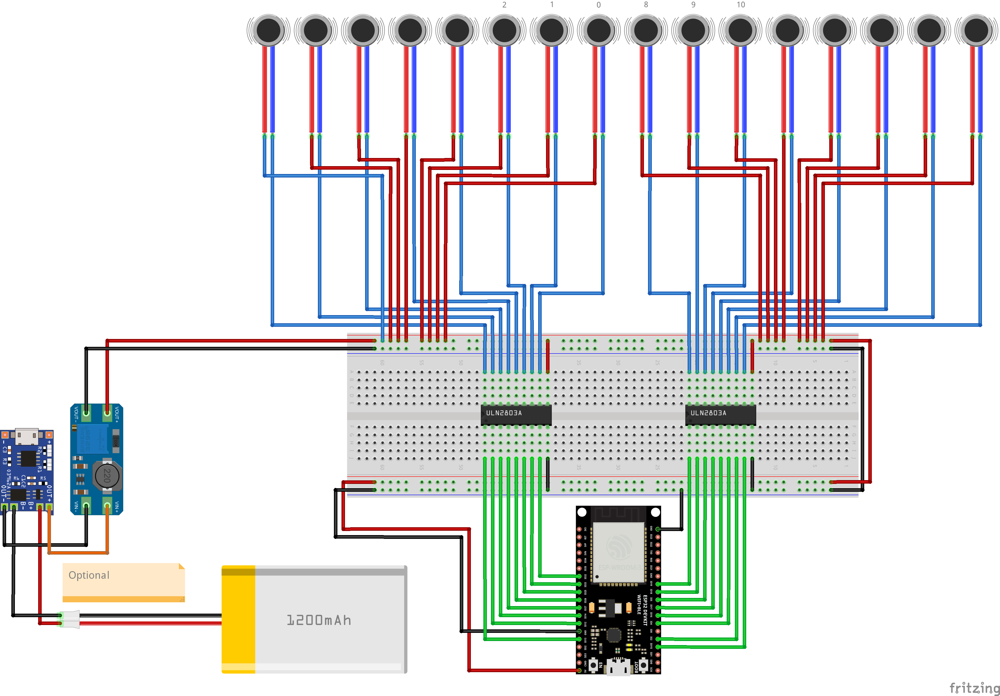

# X16 Haptic Vest

> X16 Haptic Vest with 5V vibro motors powered by LiPo battery

## Bill of materials

| Component                        | Quantity |    Price | Link  |
| :------------------------------- | -------: | -------: | :---- |
| `ESP32-DevKitC`                  |       x1 | ~US $1.3 | `n/a` |
| `ULN2803A`                       |       x2 | ~US $0.3 | `n/a` |
| 5V Vibro Motors                  |      x16 | ~US $1.1 | `n/a` |
| `TP4056` (Optional)              |       x1 | ~US $0.3 | `n/a` |
| `MT3608` (Optional)              |       x1 | ~US $0.4 | `n/a` |
| LiPo Battery (Optional)          |       x1 | ~US $7.0 | `n/a` |
| `MAX17048` Fuel Gauge (Optional) |       x1 | ~US $5   | `n/a` |

## Schematic

### Required Pins

* PWA pins: `32`, `33`, `25`, `26`, `27`, `14`, `12`, `13`, `19`, `18`, `5`, `17`, `16`, `4`, `2`, `15`

### Wiring Diagram

> Please note motor indices
