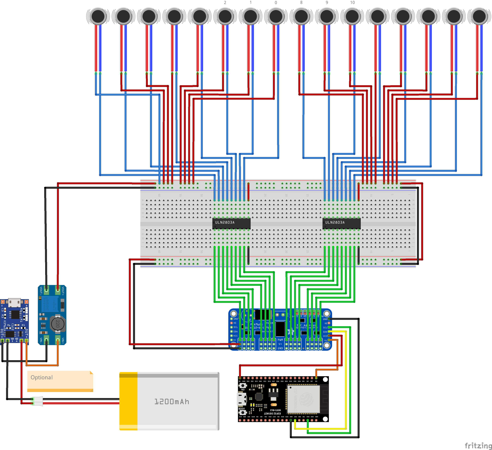

# X16 Haptic Vest

> X16 Haptic Vest with 5V vibro motors powered by LiPo battery

## Bill of materials

| Component           | Quantity |    Price | Link  |
| :------------------ | -------: | -------: | :---- |
| ESP32-DevKitC       |       x1 | ~US $1.3 | `n/a` |
| PCA 9685 PWM Driver |       x1 | ~US $3.0 | `n/a` |
| ULN2803A            |       x2 | ~US $0.3 | `n/a` |
| 5V Vibro Motors     |      x16 | ~US $1.1 | `n/a` |

## Schematic

### Required Pins

* SDA: `21`
* SCL: `22`

### Wiring Diagram

> Please note motor indices

### Circuit Diagram

> See [Main Board - PWM X16 - DIY Kit](../../OpenHaptics%20Boards/Main%20Board%20-%20PWM%20X16%20-%20DIY%20Kit/) for full hardware

